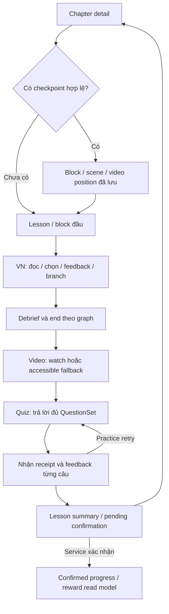

# M3-UX-01 — Learning UI/UX handoff

> Status: REVIEW — design proposal, chưa có reviewer sign-off\
> Owner: Trúc (Member 2); Executor: Codex\
> Date: 2026-10-01; baseline: `origin/main` / `bc94425`

[Task card](../tasks/active/M3-UX-01.md) · [Prototype](./m3-ux/index.html) · [State matrix](./m3-ux/STATE-MATRIX.md) · [Evidence](./m3-ux/EVIDENCE.md)

## 1. Phạm vi và cách xem

Thiết kế cho lesson reader, VN, video và quiz trên mock services M2; thêm chapter entry và lesson completion để thấy điểm vào/ra. Không triển khai feature runtime, không thay service/type và không mở content production.

Chạy `node docs/engineering/m3-ux/serve.mjs`, mở `http://127.0.0.1:4178`. Panel review bên ngoài app chọn màn, trạng thái và chiều rộng 375/430px; nút Làm mới lượt xem đặt lại fixture để thử từ đầu. Panel thu gọn trên mobile. Bắt đầu từ Chapter để thử toàn bộ luồng; controls này không đưa vào sản phẩm. Prototype dùng ES modules nên xem qua localhost, không mở bằng `file://`; giữ terminal server chạy khi xem.

Prototype chỉ chứa chữ minh họa kỹ năng đọc tư liệu; không kể lại sự kiện, không seed/publish story và không sử dụng ảnh/nhạc/video canonical. Giấy/bút là SVG trang trí; video là mô phỏng 60s. Quiz đáp án cục bộ chỉ để kiểm tra visual feedback. Chọn reward confirmed ở panel review chỉ đổi fixture giao diện, không xác nhận XP thật.

## 2. Luồng chính và vị trí khôi phục

Đây là mixed lesson minh họa, không ép mọi lesson đi theo cùng thứ tự. Runtime sắp xếp `Lesson.blocks` theo `order`, render theo `kind`, dùng `block.id` làm identity. Debrief/end trong VN theo authored graph; wireframe VN tập trung vào choice/review, không giả lập một story canonical đầy đủ.

- Start: nhận lesson và progress, chưa có progress thì mở required block đầu; không dùng numeric index làm checkpoint.
- Resume: dùng `getResumePoint(lessonId)`; block, scene/version hoặc video position theo discriminator. Không tự chuyển sang story version mới.
- Back/review: không xóa progress, không mở lại quyền thay choice đã khóa. Prototype cho xem lại đoạn đọc rồi quay VN vẫn thấy choice khóa.
- Rời bài: giữ bookmark; prototype lưu riêng key `suchill.m3-ux.prototype.v1`. Runtime phải dùng progress service, không sao chép storage này làm authoritative progress.
- Retry lỗi tải: dùng lại operation ID khi gửi lại cùng thao tác; không tạo attempt chỉ vì reload/lỗi media.
- Restart VN: xác nhận bằng Modal; cần thao tác service riêng trước khi áp dụng vào runtime (gap G1).
- Completion: phân biệt block/episode/lesson/chapter. Prototype chỉ có tổng kết lesson; chapter completion chỉ xuất hiện khi mọi required lesson/final assessment đạt.

## 3. Wireframes và cấu trúc màn

| Màn | Thứ tự từ trên xuống | Hành động chính / phụ |
|---|---|---|
| Chapter | TopBar, hero chữ/SVG giấy, mô tả, meta, 4 hoạt động với icon và số thứ tự | Start/Resume; vào đúng bookmark |
| Lesson | Eyebrow, heading, progress, text card, source panel, action bar | Continue; nguồn; tạm dừng |
| VN | Heading/progress, vignette giấy gọn, nhãn choice intent, prompt/options A/B, response | Ghi nhận → tiếp tục; review/restart trên một hàng |
| Video | Heading/progress, poster, media card với timecode/seek, play/captions, volume, transcript/source | Continue theo policy; pause/exit; fallback |
| Quiz | Heading/progress, mỗi question card/options A/B, icon/text/explanation sau receipt | Nộp đủ câu; retry; tổng kết |
| Completion | Hero/book seal, recap checklist, pending hoặc confirmed status, action bar | Về chương; xem lại; chưa có XP giả |

Một primary action mỗi màn. Nội dung cuộn tự nhiên; action bar nằm trong document flow để đoạn tiếng Việt dài không bị footer/sticky CTA che. TopBar giữ back và mute. Không thêm BottomNav trong player; exit về chapter dùng shell/nav M1.

Lượt polish 2026-10-01 thống nhất icon nét mảnh, spacing và thứ bậc chữ; secondary actions nhẹ hơn primary CTA. Selected narrative giữ màu trung tính và dấu ghi nhận; quiz dùng đúng/sai kèm text/icon. Captions có `aria-pressed`; seek có timecode và `aria-valuetext` đồng bộ. [Ảnh desktop](./m3-ux/evidence/desktop-review-1280.png) minh họa panel và app frame.

## 4. Visual và component mapping

`src/theme/tokens.ts` là authority. `tokens.css` được sinh bởi `generate-tokens.mjs`; không chỉnh tay. Palette giấy/mực/đỏ giữ từ M1; selected narrative dùng `colors.selected`, feedback kiến thức dùng `colors.correct/incorrect`. Mọi radius/spacing/shadow/motion trong CSS prototype dùng snapshot token.

| Vùng thiết kế | Primitive hiện hành / áp dụng |
|---|---|
| CTA/back/mute | Button / IconButton; native button; disabled và aria label rõ |
| Text/question/summary | Card + Badge; heading semantics và wrap tiếng Việt |
| Progress | Progress + nhãn bằng chữ; % chỉ từ progress read model |
| Narrative/reflection | ChoiceOption type narrative/reflection, không truyền correct |
| Branching | Selected trung tính; owner xác nhận mapping type (G4), không mượn knowledge |
| Quiz trước receipt | Button/native selectable option; không yêu cầu answer key (G3) |
| Quiz sau receipt | Feedback card theo QuestionFeedback; text/icon + màu |
| Restart | Modal M1; initial focus vào Cancel, trap Tab, Escape, restore opener |
| Shared state | LoadingState/ErrorState/OfflineState/EmptyState; mô tả hành động rõ |
| Media/transcript/source | Feature composition; semantic details, native video controls khi có media |

Prototype là HTML/CSS để review, không thay thế primitive React. Heading/body dùng Inter nếu sẵn có, fallback Segoe UI/Arial để chạy offline. Tokens hiện chỉ có font class, chưa có typography scale/sound tokens; cỡ chữ/line-height trong prototype là đề xuất cần Hưng review. Không tạo thêm authority font/token vào app.

## 5. Contract mapping hiện hành (M2)

| Luồng / data | Domain | Operations tại `src/services/next/contracts.ts` |
|---|---|---|
| Chapter entry | Chapter, Lesson, LessonProgress | chapters.listPublished/getById; lessons.getById; progress.getLessonProgress |
| Text/recap | TextBlock/RecapBlock, LearningDocument | documents.getById(documentId) |
| VN graph | StoryVersion, VisualNovelScene, SceneChoice | stories.getVersion; progress.getEpisodeProgress/getResumePoint |
| VN checkpoint/choice | EpisodeProgress, lockedChoiceIds | saveEpisodeCheckpoint; recordChoice với lesson/block/version/scene/choice ID |
| Video/media | VideoBlock, ResolvedMediaAsset, VideoProgress | media.getResolvedAsset; getVideoProgress/saveVideoPosition |
| Quiz delivery | QuestionSetDelivery, DeliveredQuestion | quiz.getQuestionSet; không đưa đáp án/explanation trước nộp |
| Quiz submit | PracticeQuizReceipt / ScoredQuizReceipt | submitPracticeAttempt / submitScoredAttempt; feedback map bằng questionId |
| Lesson checkpoint | LessonProgress | progress.saveCheckpoint; operationId giữ cho retry cùng payload |
| Profile | CurrentUserProfile | users.getCurrentProfile; thiếu tên → lời chào chung |
| Completion/reward | RewardLedgerEntry chỉ là type | Chưa có completion/reward read operation trong LearningServices (G2) |

Practice phải trả lời tất cả `QuestionSet.questionIds` trước nộp; receipt feedback từng câu, retry không phạt. Scored mode chỉ hiển thị `score/total/passed` từ receipt; không tính pass threshold ở UI. Knowledge check trong story theo `scene.policy`; sai `retry_until_correct` giữ cùng scene, đúng hoặc continue policy theo graph. Narrative response không mang correctness.

Video optional có thể tiếp tục mà không chặn completion (fixture hiện tại). Required media dùng completionPolicy; tua cuối không đủ thay unique watched ranges. Fallback đã duyệt + recap/check bắt buộc có thể hoàn thành theo Phase 7, nhưng đọc transcript không tự trao reward. Save position không phải completeActivity.

## 6. Contract gaps cần owner xử lý

| ID | Khoảng trống quan sát được | Owner / bước tiếp theo |
|---|---|---|
| G1 | ProgressService chưa có restart/reset episode; adapter giữ lockedChoiceIds và trả conflict khi đổi choice | Vinh đề xuất operation lifecycle, Hưng review, Dương consumer; prototype chỉ reset local fixture |
| G2 | Chưa có completeActivity, reward/streak summary hoặc pending/confirmed receipt trong LearningServices | Vinh + PO chốt task/contract theo M4/M5; Dương hiển thị pending và không grant XP trong M3 |
| G3 | ChoiceOption knowledge yêu cầu correct trước reveal, DeliveredQuestion không chứa key | Hưng/Dương chọn option component trước submit hoặc đề xuất API nhận receipt feedback; không suy key client |
| G4 | SceneChoice có kind branching; ChoiceOption chỉ khai báo narrative/reflection/knowledge | Hưng/Dương xác nhận presentation mapping branching → narrative; thay primitive chỉ khi có claim riêng |
| G5 | Mock position không set completed true và lesson checkpoint giữ in_progress | Completion UI chỉ là design/read model; Vinh chốt trusted completion task, không dùng saveCheckpoint để thưởng |

Các gap không chặn review thiết kế; chặn việc sao chép mô phỏng vào runtime như contract đã hoàn tất. Không tự sửa source hotspot trong M3-UX-01.

## 7. Bàn giao và review

Gói gồm prototype, token snapshot/generator, state matrix, screenshots và browser verification script. Không có env/migration/dependency impact; CONTENT-007 vẫn BLOCKED theo card riêng.

- Dương: review flow/state/service consumption, optional vs required video, receipt quiz; nhận handoff cho M3-02..05.
- Hưng: review tokens/typography/primitives feasibility, G3/G4 và Modal contract.
- Vinh: review accessibility evidence, version/checkpoint/retry semantics và G1/G2/G5.
- Product Owner: nghiệm thu visual/flow sau reviewer; chỉ reviewer cập nhật task DONE.

Xem [evidence và giới hạn kiểm tra](./m3-ux/EVIDENCE.md). Screen-reader, safe-area phần cứng, playback/caption sync thật và thiết bị yếu vẫn cần QA khi implementation có media được duyệt. Prototype không chứng minh gate M3 runtime hoặc release.
